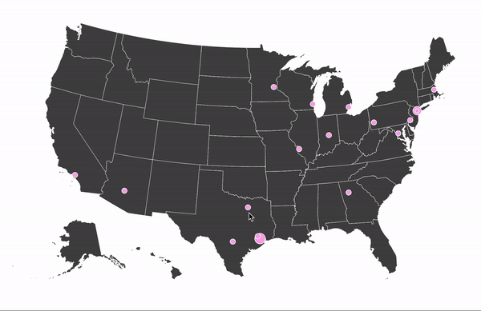

# D3 & React!

This is a basic demo of rendering projected SVG paths using D3 within a basic React + Webpack + Redux + React-Router context. 



With the raw SVG exposed like this, you have easy access to insert function handles on the SVG fills, modify colors to represent dynamic data, etc. This demo is hosted on Firebase and runs serverless. Check out the live demo at https://d3-geo-react.firebaseapp.com/#/, mouse clicks are logged to the console. 

# Running

```
> git clone https://github.com/KacobJeith/d3-geo-react
> cd d3-geo-react
> npm install 
> npm run bs
```

go to localhost:5000 in your browser to see the output. 

enjoy!
